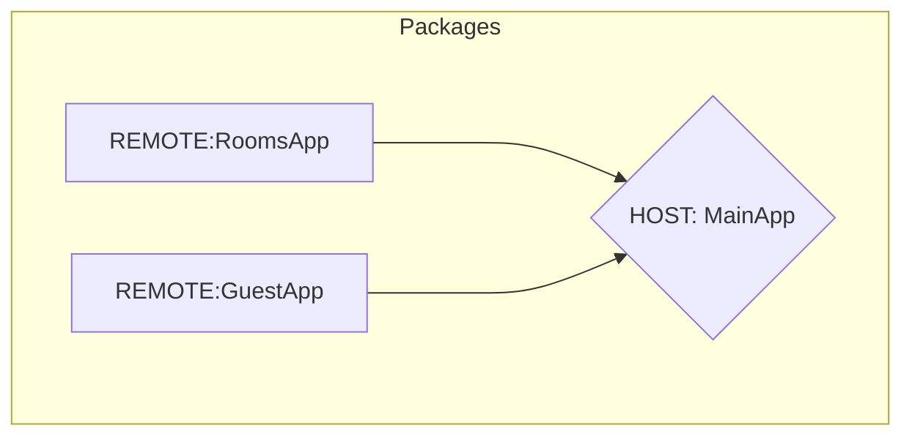

# 🏨 Microfrontend My Reservation

Aplicación desarrollada con MFE que muestre el detalle de una reserva, consta las siguientes aplicaciones

1. My Reservation (Main App)
2. Room Detail (Remote App)
3. Guest Detail (Remote App)

## 💻 Technologies

- Vite
- OriginJs Vite Module Federation
- Vue 3
- Pinia Class
- Element Plus

## 🚀 Architecture

## 👔 How to use

    pnpm install
    pnpm build

## Guide Line

_https://coolors.co/palette/16697a-489fb5-82c0cc-ede7e3-ffa62b_

**Author** _Diego Ceron_
